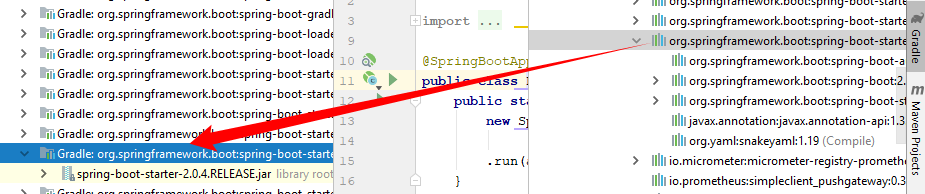

= IntelliJ Idea plugin to reveal gradle dependency in external libraries tree.
:icons: font

image:https://travis-ci.com/jvmlet/reveal-dependency-plugin.svg?branch=master[Build Status,link=https://travis-ci.com/jvmlet/reveal-dependency-plugin]
image:https://img.shields.io/jetbrains/plugin/d/11236.svg["JetBrains IntelliJ plugins",link="https://plugins.jetbrains.com/plugin/11236-reveal-gradle-dependency-in-external-libraries-tree-"]
image:https://img.shields.io/jetbrains/plugin/v/11236.svg["JetBrains IntelliJ plugins",link="https://plugins.jetbrains.com/plugin/11236-reveal-gradle-dependency-in-external-libraries-tree-"]

Right-click on gradle dependency node to navigate to linked external library. +
*Works at any level of dependency hierarchy*

[NOTE]
Install manually by downloading from https://plugins.jetbrains.com/plugin/11236-reveal-gradle-dependency-in-external-libraries-tree-[here]
or from IntelliJ  (search in repository by name `Reveal gradle dependency in external libraries tree.` )

